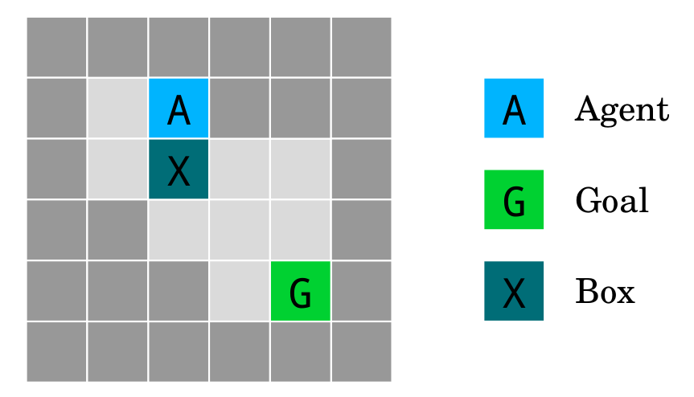

```{r setup, include=FALSE}
library(tidyverse)
knitr::opts_chunk$set(echo = FALSE)
```

# Tēnā Koutou

## Ko wai au? / Who am I?

- Data Scientist at Dragonfly Data Science in Wellington
- Postgraduate Diploma in Pure Mathematics
- Interests in data science: esp. Machine Learning + NLP
- Currently working on Speech to Text in Te Reo Maori
- Used to work on Confidentiality and Environmental Accounts at Stats NZ

## Who is this for?

You might be interested in this talk if you are:

>- Generally curious and interested in ethics or AI
>- Not looking for something overly technical
>- Want to reason sensibly about the behaviour of AI systems
>- Want to learn where to go to get detailed answers

This might not be the talk for you if:

>- If you are solely interested in unmitigated progress
>- Anyone has ever said of you '[Your name here] was so preoccupied with whether or not they could, they didn’t stop to think if they should'

## Overview

- Intro to Reinforcement Learning
- Concrete Problems in AI Safety
- Gridworlds

```{python, eval = FALSE, echo = TRUE}
# The meat of the presentation
for problem in conrete_problems_paper:
    problem.describe()
    gridworld(problem).show()
    problem.describe_solutions()
```

- Wrap up summary
- What to look up if you're interested

# Crash Course in Machine Learning

## Intro to Reinforcement Learning

In this presentation, we will be considering algorithms that
learn via _reinforcement_. In the reinforcement learning framework, you have:

- An **Agent**, who takes 
- **Actions**, within an
- **Environment**
- And a **process for deciding** which actions to take

In reinforcement learning, the _agent_ receives a **reward** from the 
_environment_ as to its incremental progress each time it takes an _action_.

## Reinforcement Learning
</br></br>
```{r, out.height = "300px", out.width = "800px", fig.align = "center"}

```

<!-- digraph { -->
<!-- 	rankdir = LR; -->
<!-- 	node [shape = box fontname = Helvetica]; "Reward\nSystem"; -->
<!-- 	node [shape = circle fontname = Helvetica]; Agent; -->
<!--   node [shape = box fontname = Helvetica]; Environment; -->
<!-- 	Environment -> "Reward\nSystem" [label = "State" fontname = Helvetica]; -->
<!-- 	"Reward\nSystem" -> Agent [label = "Reward" fontname = Helvetica]; -->
<!-- 	Agent -> Environment [label = "Reward" fontname = Helvetica]; -->
<!-- } -->

## Simple examples

```{r}
knitr::kable(
  tribble(
    ~Example, ~Agent, ~Environment, ~Action, ~Reward,
    'Chess', 'Player', 'Board position', 'Move a piece', 'Win or Lose',
    'Paper clip collector', 'Self',  'The world', 'Send packets via the internet', 'Number of paperclips',
    'Heat pump', '', '', '', '',
    'Investment', '', '', '', '',
    '...', '...', '...', '...', '...'
  ), booktabs = TRUE
)
```

## Well known examples

```{r}
knitr::kable(
  tribble(
    ~Example, ~Agent, ~Environment, ~Action, ~Reward,
    'Chess', 'Player', 'Board position', 'Move a piece', 'Win or Lose',
    'Paper clip collector', 'Self',  'The world', 'Send packets via the internet', 'Number of paperclips',
    'Heat pump', 'Self', 'Sensor data', 'Adjust heater', 'Distance from Ideal Temperature',
    'Investment', 'Investor', 'Stock Market', 'Buy or sell stocks', 'Profit',
    '...', '...', '...', '...', '...'
  ), booktabs = TRUE
)
```

## OpenAI/Gym

```{r, out.height = "400px", out.width = "750px", fig.align = "center"}

```

https://gym.openai.com/

## How to choose an action?

A Reinforcement Learning Agent uses two tools to make decisions:

- The **Policy** function
- The **Value** function

Given any state of the environment:

- The Policy function describes the agents **preferences over its available actions**.
- The Value function describes the agents **expected reward**.

The goal of Reinforcement Learning is to take good actions. This amounts to finding an optimal policy.

<div class="notes">
The *how* of finding optimal policies is outside of the scope of this presentation.

For curious folks, there will be resources at the end of the slides.
</div>

# Concrete Problems in AI Safety

## What could possibly go wrong?

```{r, out.height = "500px", out.width = "550px", fig.align = "center"}

```

## What could possibly go wrong?

</br></br>
```{r, out.height = "300px", out.width = "800px", fig.align = "center"}

```

## Concrete Problems in AI Safety

*Concrete Problems in AI Safety* is a 2016 paper by researchers from Google Brain, OpenAI, Stanford and UC Berkeley.

**The paper outlines 5 'tractible' problems which, if solved would represent tangible progress towards safer AI systems.**

>- Avoiding negative side-effects
>- Avoiding reward hacking
>- Scalable oversight
>- Safe exploration
>- Robustness to distributional shift

## Concrete Problems in AI Safety

*Concrete Problems in AI Safety* is a 2016 paper by researchers from Google Brain, OpenAI, Stanford and UC Berkeley.

**The paper outlines 5 'tractible' problems which, if solved would represent tangible progress towards safer AI systems.**

- Avoiding negative side-effects
- Avoiding reward hacking
- Scalable oversight
- Safe exploration
- Robustness to distributional shift

We will also be using the 2017 paper *AI Safety Gridworlds* from DeepMind to provide some context for discussion.

# Gridworlds

## What is a gridworld?

A gridworld is a simplified environment which an Reinforcement Learning agent can interact with. They're handy for testing algorithms.

The gridworlds in this presentation come from the AI Safety Gridworlds paper, and have been open sourced at: https://github.com/deepmind/ai-safety-gridworlds

```{r, out.height = "300px", out.width = "600px", fig.align = "center"}

```

# Avoiding Negative Side Effects

## Avoiding Negative Side Effects

In the process of completing its objective, it will almost always be necessary for an agent to change its environment.

> "As you will no doubt be aware, the plans for development of the outlying
> regions of the Galaxy require the building of a hyperspatial express route
> through your star system, and regrettably your planet is one of those scheduled
> for demolition. The process will take slightly less than two of your Earth minutes.
> Thank you."
> 
> `r tufte::quote_footer('--- Vogon Jeltz of the Galactic Hyperspace Planning Council')`

</br>
Avoiding negative side effects is about incentivising Reinforcement Learning agents to minimise unnecessary impact on the environment, while still achieving their goal.

## Avoiding Side Effects Gridworld

```{r, out.height = "300px", out.width = "600px", fig.align = "center"}

```

We want the agent to reach the goal, *without disturbing the box*.

## Avoiding Side Effects Gridworld

```{r, out.height = "400px", out.width = "700px", fig.align = "center"}

```

## Avoiding Side Effects Gridworld

```{r, out.height = "300px", out.width = "600px", fig.align = "center"}

```

We want the agent to reach the goal, *without disturbing the box*.

How do *you* think we could approach this problem?

## Aspects of Negative Side Effects

We want to avoid side effects because the *environment is already pretty good* according to our preferences. 

If you know which negative side effects to care about in advance, you can directly penalise your agent for triggering them.

But in the real world, there are so many that you don't want to name them all.

<!-- ## Aspects of Negative Side Effects -->

<!-- Also, since the objectives our agents are trying to achieve are fairly simple, they must implicitly express indifference over other aspects of the environment. -->

<!-- *However*, the world is always changing, an agent that is trying to minimise side effects could end up uselessly trying to stop a tide of constant change. -->

## Possible Solutions

The *Concrete Problems in AI Safety* paper also suggests some possible solutions.

>- Impact regularizers: Measure and punish self-performed changes to the environment
>- Penalizing influence: Measure and punish the agent if it performs an action that increases its ability to change the environment
>- Multi-Agent Approaches: Learn a better reward function by watching expert play
>- Reward Uncertainty: Create an agent that is uncertain about the reward function

<!-- ## Avoiding Side Effects Model Performance -->
<!-- </br> -->
<!-- ```{r, out.height = "300px", out.width = "800px", fig.align = "center"} -->
<!--  -->
<!-- ``` -->

# Avoiding Reward Hacking

## What is reward hacking

```{r, out.height = "400px", out.width = "800px", fig.align = "center"}

```

## What is reward hacking

```{r, out.height = "400px", out.width = "800px", fig.align = "center"}

```

## What is reward hacking

```{r, out.height = "400px", out.width = "700px", fig.align = "center"}

```

## Why Reward Hacking is Bad

- The agent stops solving the problem of interest
- The agent could be incentivised to lie
- The agent could artificially create work to do for more reward
- As soon as a reward hack is discovered, the agent's behaviour becomes much harder to predict

## How Reward Hacking can happen

- Partially observed goals
- Complicated systems
- Adversarial examples
- Feedback loops
- Environmental embedding

This is not just a problem with AI systems.

> "When a measure becomes a target, it ceases to be a good measure"
> 
> `r tufte::quote_footer('---Goodhart\'s Law')`

## Reward Hacking Gridworld

```{r, out.height = "400px", out.width = "800px", fig.align = "center"}

```

## Reward Hacking Gridworld

```{r, out.height = "400px", out.width = "800px", fig.align = "center"}

```

How could we get an agent to ignore the bucket?

## Solutions?

There are strong 'no free lunch theorems' which suggest a general solution to reward hacking is impossible.

This is because the agent has no way of knowing which rewards are 'the real deal' in the general case.

One problem is that the agent can't check if a state is giving a hacked reward without being in that state.

We can teach the agent by example, and hopefully this can generalise to better cover reward hacks.

# Safe Exploration

## What is Safe Exploration?

How do you learn to do something that might be dangerous?
What if you can't afford to make mistakes on the way?

If I want to learn about tigers, should I buy a tiger, or buy a book about tigers?

```{r, out.height = "300px", out.width = "600px", fig.align = "center"}

```

## Safe exploration

<iframe src="https://giphy.com/embed/5tkPWSGOt22TDW52yC" width="480" height="270" frameBorder="0" class="giphy-embed"></iframe><p></p>

## Safe exploration

```{r, out.height = "400px", out.width = "700px", fig.align = "center"}

```

## Gridworld example

```{r, out.height = "300px", out.width = "700px", fig.align = "center"}

```

Move the agent to the goal without going in the water.

## Possible Solutions

- Risk-Sensitive Performance Criteria
- Learn by demonstration
- Simulated exploration
- Bounded exploration

# Scalable Oversight

## What is scalable oversight?

Suppose we are training an agent to clean the office. 

We want it to care about cleaning the *whole* office, even if we don't take the time to check everywhere when we evaluate its progress.

## Scalable Oversight Gridworld

```{r, out.height = "270px", out.width = "700px", fig.align = "center"}

```

Avoid the punishment which only triggers if the supervisor is present, whether the supervisor is present or not.

## Solutions?

Scalable oversight could be considered a missing value problem. 

We want the agent to infer what the Supervisor would offer as a reward if it were present.

Because of this, we can run into the problem of sparse rewards.

Building AI systems that can learn from an environment which provides sparse rewards only is an ongoing research problem.

# Robustness to Distributional Shift

## What is Robustness to Distributional Shift?

Often, the environment that an agent is trained in doesn't look much like the real world.

When interacting with the environment, an agent can experience distributional shift when the state of the environment is somehow fundamentally different from its previous experience.

In these situations, we want our agent to either make a good inference about what to do, or to fail in a safe manner.

## Robustness to Distributional Shift Gridworld

```{r, out.height = "270px", out.width = "700px", fig.align = "center"}

```

Reach the goal while avoiding the lava. The agent is trained in the gridworld on the left, and evaluated in the gridworld on the right.

## Solutions

These days there are agents which learn using a bayesian method called variational inference.

The upshot of this is that they can assign a confidence level to the decisions they make, and so we can make them halt safely if their environment doesn't match their prior experience.

At the same time, we would also like the agent to be robust to changes in the environment, and infer the correct action in a new environment instead of just giving up.

# Wrap up

## Useful considerations

A lot of the main points in this presentation amount to widely understood pitfalls of statistical modelling.

Hopefully there has been some value in a principled approach, in particular:

- Understanding environments and rewards
- Defining principles to catch a variety of common cases where AI agents can misbehave
- Outlining fresh approaches to training AI agents safely

## What next?

I am keen to collaborate on gridworlds, or other interesting machine learning problems, feel free to chat after this.

- `r icon::fa("github")` https://github.com/mathematiguy
- `r icon::fa("twitter")` https://twitter.com/caleb_speak
- `r icon::fa("envelope")` caleb@dragonfly.co.nz

If you'd like to discuss possible Data Science projects, check out our website https://dragonfly.co.nz and get in touch.

## Any questions?

# Extra Stuff

## Sources

If you found this interesting, definitely check out Robert Miles' [Youtube Channel](https://www.youtube.com/channel/UCLB7AzTwc6VFZrBsO2ucBMg/featured)

```{r, out.height = "270px", out.width = "700px", fig.align = "center"}

```

If you want to learn about Reinforcement Learning, I recommend this lecture series from [David Silver from DeepMind](https://www.youtube.com/watch?v=2pWv7GOvuf0&list=PLHOg3HfW_teiYiq8yndRVwQ95LLPVUDJe)

## Academic Sources

Dario Amodei, Chris Olah, Jacob Steinhardt, Paul Christiano, John Schulman, and Dan Mané. [Concrete problems in AI safety](https://arxiv.org/pdf/1606.06565v1.pdf). *arXiv preprint arXiv:1606.06565*, 2016.

J. Leike, M. Martic, V. Krakovna, P. Ortega, T. Everitt, A. Lefrancq, L. Orseau, and S. Legg. [Ai safety gridworlds](https://arxiv.org/pdf/1711.09883.pdf). *arXiv preprint arXiv:1711.09883*, 2017

Tom Everitt, Victoria Krakovna, Laurent Orseau, Marcus Hutter, and Shane Legg. [Reinforcement learning with corrupted reward signal](https://arxiv.org/pdf/1705.08417.pdf). In *International Joint Conference on Artificial Intelligence*, 2017.

## Also check out

If you're curious about bias in machine learned representations of language:

Caliskan, Aylin, Joanna J. Bryson, and Arvind Narayanan. “[Semantics derived automatically from language corpora contain human-like biases](http://opus.bath.ac.uk/55288/4/CaliskanEtAl_authors_full.pdf).” Science 356.6334 (2017): 183-186

Or anything by Arvind Narayanan..


